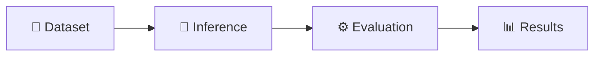
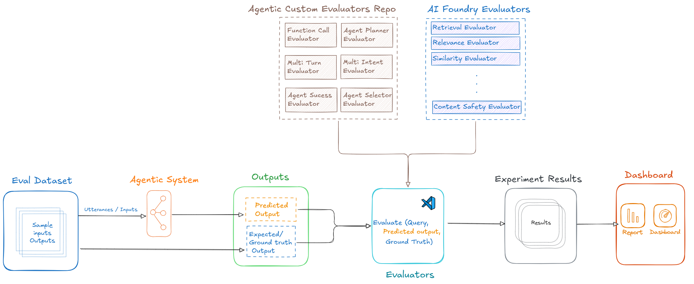
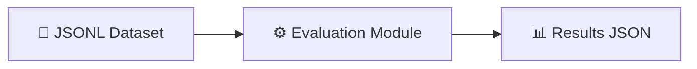
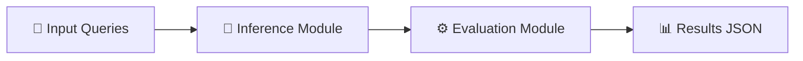
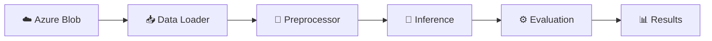

# Evaluation Framework using Microsoft Foundry

[](https://opensource.org/licenses/MIT)
[](https://www.python.org/downloads/)
[](https://azure.microsoft.com/en-us/products/ai-foundry)

A config-driven evaluation framework for **agentic systems** and **GenAI applications** built on Microsoft Foundry SDK. Get started in minutes with YAML-based experiment configuration.

Whether you're evaluating RAG applications, multi-agent systems, or custom GenAI workflows, this framework reduces boilerplate and accelerates iteration.

## Key Features

- **🚀 Quick Setup** — Config-driven YAML files; swap datasets, models, or metrics instantly
- **🔌 Plug-and-Play** — Modular architecture for custom data loaders, evaluators, and pipeline stages
- **📊 AI Foundry Evaluators** — Built-in RAG metrics (Relevance, Coherence, Groundedness) and Agentic metrics (Task Adherence, Tool Call Accuracy)
- **🎯 Custom Evaluators** — Create domain-specific metrics with simple Python classes
- **⚖️ LLM-as-Judge** — Build custom AI judges using prompty templates for flexible scoring
- **🔗 Experimentation Pipelines** — Combine data loading, inference, and evaluation in configurable YAML pipelines



## About This Framework

This framework provides two core capabilities for rapid AI evaluation:

1. **Simplified Evaluation SDK Integration** — Easily add both built-in Microsoft Foundry evaluators and custom metrics with minimal code
2. **Pipeline-Based Architecture** — Connect your experiments, inference modules, and data loaders through a configurable pipeline defined in YAML




---

## Folder Structure

```text
Agentic-Evaluations/
├── src/
│   ├── agent_evaluation/           # Core evaluation engine
│   │   └── agentic_ops/            # Runner, client, base evaluator
│   └── evaluations/
│       └── offline/
│           ├── agentic_evaluation/          # Agentic metrics (tool call accuracy, recall@k)
│           ├── ai_judge_evaluation_custom/  # LLM-as-Judge with prompty templates
│           ├── genai_evaluation_foundry/    # Built-in RAG evaluators (Relevance, Coherence)
│           ├── pipeline_experiment_evaluation/ # Full pipeline (data → inference → eval)
│           └── utils/                       # Shared constants and utilities
├── assets/                         # Architecture diagrams
├── .env.template                   # Environment variable template
├── requirements.txt                # Python dependencies
└── README.md
```

Each evaluation folder follows the same layout: `datasets/` for input data, `evaluator/` for evaluation logic, and an `experiment.yaml` for configuration. Evaluation outputs are written to the shared `src/evaluations/offline/reports/` directory.

---

## Table of Contents

- [Folder Structure](#folder-structure)
- [Getting Started](#getting-started)
- [Samples](#samples)
- [Visualization Dashboard](#visualization-dashboard)
- [Configuration Guide](#configuration-guide)
- [Creating New Evaluations](#creating-new-evaluations)
- [Evaluators Reference](#evaluators-reference)
- [Pipeline Architecture](#pipeline-architecture)
- [References](#references)

---

## Getting Started

### Prerequisites

- Python 3.11+ and Git
- Azure CLI installed and authenticated
- Microsoft Foundry project with GPT-4o deployment

### Quick Start

```bash
# 1. Clone and install
git clone https://github.com/Azure-Samples/Agentic-Evaluations.git
cd Agentic-Evaluations
python -m venv .venv
.venv\Scripts\activate  # Windows PowerShell
# source .venv/bin/activate  # Linux/macOS
pip install -r requirements.txt

# 2. Azure login
az login
az account set --subscription "<your-subscription-id>"

# 3. Configure environment
cp .env.template .env
# Edit .env with your Microsoft Foundry credentials:
#   EVAL_AZURE_OPENAI_ENDPOINT=https://<your-resource>.openai.azure.com/
#   EVAL_AZURE_OPENAI_MODEL=<your-deployment-name>
#   EVAL_AZURE_OPENAI_VERSION=2024-12-01-preview

# 4. Run a sample evaluation (interactive CLI)
python -m agent_evals run
```

**Results:** `src/evaluations/offline/reports/{run_id}_{eval_dir_name}.json`

---

## CLI

The framework includes an interactive CLI that auto-discovers all evaluation samples. No need to remember long config paths.

```bash
# List all available samples
python -m agent_evals list

# Run interactively (shows menu, pick by number)
python -m agent_evals run

# Run by name (supports partial matching)
python -m agent_evals run rag_evaluation_foundry
python -m agent_evals run agentic

# Run by number from the list
python -m agent_evals run 1

# Show sample details (evaluators, dataset, stages)
python -m agent_evals info agentic_evaluation

# Run all samples sequentially
python -m agent_evals run-all
```

New samples added to `src/evaluations/offline/` are automatically discovered as long as they contain an `experiment.yaml` file.

---

## Samples

| Sample | Description | Command |
|--------|-------------|---------|
| [`rag_evaluation_foundry`](./src/evaluations/offline/genai_evaluation_foundry/README.md) | **Standard GenAI/RAG** — Built-in evaluators (Relevance, Coherence, Fluency) | `python -m agent_evals run rag_evaluation_foundry` |
| [`agentic_evaluation`](./src/evaluations/offline/agentic_evaluation/README.md) | **Agentic Systems** — Agent invocation accuracy, recall@k, hallucination detection | `python -m agent_evals run agentic_evaluation` |
| [`ai_judge_evaluation_custom`](./src/evaluations/offline/ai_judge_evaluation_custom/README.md) | **Custom AI Judge** — LLM-as-Judge with prompty templates | `python -m agent_evals run ai_judge_evaluation_custom` |
| [`pipeline_experiment_evaluation`](./src/evaluations/offline/pipeline_experiment_evaluation/README.md) | **Full Pipeline** — Data loading → Inference → Evaluation | `python -m agent_evals run pipeline_experiment_evaluation` |
| [`pipeline_multi_agent_evaluation`](./src/evaluations/offline/pipeline_multi_agent_evaluation/README.md) | **Multi-Agent Orchestrator** — Inference → Telemetry extraction → Evaluation for multi-agent systems | `python -m agent_evals run pipeline_multi_agent_evaluation` |
| [`pipeline_multi_tool_agent_evaluation`](./src/evaluations/offline/pipeline_multi_tool_agent_evaluation/README.md) | **Multi-Tool Agent** — Inference → Telemetry extraction → Evaluation for multi-tool agents | `python -m agent_evals run pipeline_multi_tool_agent_evaluation` |

---

## Visualization Dashboard

All evaluation runs produce a JSON report in `src/evaluations/offline/reports/` using the naming pattern `{run_id}_{eval_dir_name}.json`. The **Agentic Evaluation Dashboard** is a Streamlit app that reads these reports and renders them as interactive visualizations - no manual parsing required.

```bash
python -m streamlit run src/evaluations/offline/reports/dashboard.py
```

Key capabilities:

- **Overview page** — aggregate metric gauges and multi-run summary tables for every evaluation type
- **Run detail page** — pass/fail rates, agent routing analysis, per-row score breakdown, and reasoning drill-downs
- **Run comparison page** — metric trend charts across multiple runs of the same evaluation

For full usage instructions, gauge scale conventions, and how to extend display names for custom evaluators, see the [Dashboard README](./src/evaluations/offline/reports/README.md).

---

## Configuration Guide

### experiment.yaml Structure

```yaml
app_name: Agentic-Evals
experiment_name: My_Evaluation

evaluation:
  run_local: True                    # Local execution (recommended)
  input_path: datasets/
  input_file: my_data.jsonl
  output_path: src/evaluations/offline/reports/
  
  evaluators:                        # Evaluators to run
    relevance: "relevance_evaluator"
    coherence: "coherence_evaluator"
  
  evaluator_config:                  # Map dataset fields to evaluator inputs
    relevance:
      column_mapping:
        query: "${data.query}"
        response: "${data.response}"

pipeline:                            # Pipeline stages
  - base_path: evaluator
    module: eval_main.eval_main
    config_key: evaluation
```

**Key Points:**
- `${data.<field>}` syntax maps JSONL dataset fields to evaluator parameters
- Evaluator keys become column names in results
- See [Built-in Evaluators](#built-in-evaluators-azure-ai-foundry) for parameter requirements

---

## Creating New Evaluations

### 1. Copy a sample and prepare your dataset

```bash
cp -r src/evaluations/offline/genai_evaluation_foundry src/evaluations/offline/my_evaluation
```

Create a JSONL file in `datasets/`:
```jsonl
{"query": "What is the weather?", "response": "It's sunny and 72°F.", "context": "Weather data..."}
```

### 2. Register evaluators in `eval_factory.py`

```python
from azure.ai.evaluation import RelevanceEvaluator, CoherenceEvaluator

class EvaluatorFactory:
    EVALUATOR_FACTORIES = {
        "relevance_evaluator": RelevanceEvaluator,
        "coherence_evaluator": CoherenceEvaluator,
    }
```

### 3. Configure and run

Update `experiment.yaml` with your evaluators and column mappings, then:

```bash
python -m src.agent_evaluation.agentic_ops.runner --config_file src/evaluations/offline/my_evaluation/experiment.yaml
```

### Adding Custom Evaluators

```python
# evaluator/evaluator_repo/my_evaluator.py
class MyCustomEvaluator:
    def __call__(self, query, response, **kwargs):
        score = self.calculate_score(query, response)
        return {"my_metric": score}
```

Register in `eval_factory.py` and add to your `experiment.yaml`.

---

## Evaluators Reference


For AI Foundry's evaluators for Agentic and RAG see the official documentation:

📖 [Microsoft Foundry Evaluator Reference](https://learn.microsoft.com/en-us/azure/ai-foundry/how-to/develop/evaluate-sdk)

---

## Pipeline Architecture

The framework supports flexible pipeline configurations. Choose the pattern that fits your workflow:

### Pipeline 1: Evaluation Only
Use when you already have model responses and want to evaluate them.



### Pipeline 2: Inference + Evaluation
Use for end-to-end testing with your agent or model.



### Pipeline 3: Full Pipeline (Data Loading + Inference + Evaluation)
Use for production workflows with external data sources.



### Pipeline Configuration in YAML

```yaml
pipeline:
  - base_path: data_loader      # Stage 1: Load data
    module: loader.load_data
    config_key: data_config

  - base_path: inference        # Stage 2: Run inference
    module: agent.run_inference
    config_key: inference_config

  - base_path: evaluator        # Stage 3: Evaluate results
    module: eval_main.eval_main
    config_key: evaluation
```

Each pipeline stage is independently configurable—add, remove, or reorder stages as needed.

---

---

## References

- [Azure AI Evaluation SDK](https://learn.microsoft.com/en-us/python/api/overview/azure/ai-evaluation-readme?view=azure-python)
- [Microsoft Foundry Documentation](https://learn.microsoft.com/en-us/azure/ai-foundry/what-is-ai-foundry)
- [Agentic Evaluation Guide](https://learn.microsoft.com/en-us/azure/ai-foundry/how-to/develop/agent-evaluate-sdk)

---

## Cost Considerations

> **Important:** Running evaluations with Azure OpenAI models incurs costs based on token usage. The LLM-as-Judge evaluators call the model for each row in your dataset, so larger datasets will result in higher costs. Monitor your Azure subscription spending regularly and set up [Azure Cost Management](https://learn.microsoft.com/en-us/azure/cost-management-billing/) alerts. See [Azure OpenAI pricing](https://azure.microsoft.com/pricing/details/cognitive-services/openai-service/) for details.

## Clean Up Resources

When you are done experimenting, delete any Azure resources you created to avoid unnecessary charges:

```bash
az group delete --name <your-resource-group> --yes --no-wait
```

## Data Provenance

All sample datasets included in this repository are **fully synthetic**. They use fictional entities (Northwind Health, Contoso) and simulated agent interactions (smart-home device controls, weather lookups). No real customer data, personally identifiable information, or production telemetry is included in any dataset.

---

## License

MIT License - see [LICENSE](LICENSE) for details.

## Contributing

This project welcomes contributions. See [CONTRIBUTING.md](CONTRIBUTING.md) for guidelines.

This project has adopted the [Microsoft Open Source Code of Conduct](https://opensource.microsoft.com/codeofconduct/).
