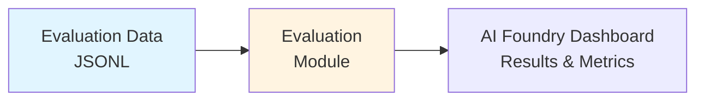
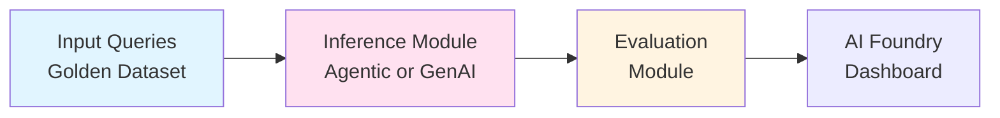
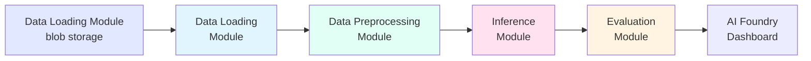
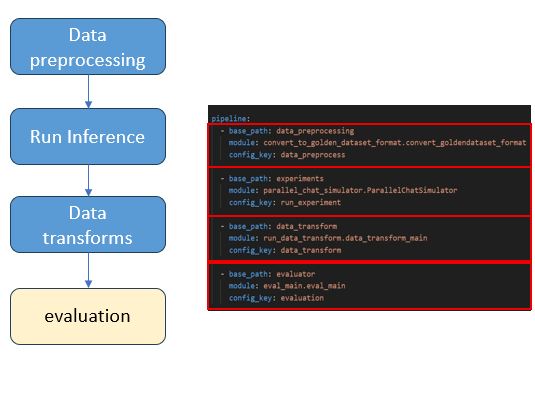

# Evaluation Framework using Azure AI Foundry

[](https://opensource.org/licenses/MIT)
[](https://www.python.org/downloads/)
[](https://azure.microsoft.com/en-us/products/ai-foundry)

A comprehensive framework that enables **quick setup, experimentation, and evaluation** for both **Agentic systems** and **GenAI applications** (such as RAG). Built on Azure AI Foundry SDK, this framework features a **configurable, pipeline-based architecture** that allows you to add your own modules as plug-and-play components. Evaluation is simplified through just **2-3 steps**, supporting both Azure AI Foundry's built-in evaluation metrics and custom metrics tailored to your specific use cases.

This repository provides a **reproducible, config-driven evaluation pipeline** designed for rapid experimentation with GenAI and agentic systems. The framework combines:

- **Plug-and-Play Architecture**: Modular pipeline design where you can easily add custom data loaders, preprocessors, evaluators, and reporting modules without modifying core framework code
- **Quick Setup**: Get started with evaluations in 2-3 simple steps - configure your experiment YAML, register evaluators, and run
- **Dual Evaluation Support**: Seamlessly use Azure AI Foundry's built-in evaluators for standardized scoring alongside custom evaluators for domain-specific or agent-level metrics
- **Flexible Workflows**: Organized into modular stages (data loading, preprocessing, evaluation, reporting) driven by experiment YAMLs, allowing you to swap datasets, models, or evaluators instantly
- **Multiple Use Cases**: Evaluate agentic systems (tool invocation, agent selection, multi-turn reasoning) as well as GenAI applications like RAG (relevance, groundedness, coherence)
- **Config-Driven Architecture**: YAML-based configuration for pipelines, evaluators, and experiments - minimum or no code changes required
- **AI Foundry Integration**: Results automatically integrate with Azure AI Foundry Evaluation dashboard for comparison across experiments and runs

Whether you're building sophisticated agentic workflows or optimizing RAG applications, this framework accelerates your evaluation process from days to hours.

### Evaluation Pipeline Diagram


## Pipeline Architecture

The framework supports flexible pipeline configurations based on your evaluation needs:

### 1. Evaluation Only Pipeline
Use this when you already have model responses and want to evaluate them.



**Use Case**: Evaluate existing model outputs, compare different models, or test custom evaluators.

### 2. Inference + Evaluation Pipeline
Use this when you need to generate responses and evaluate them in one flow.



**Use Case**: End-to-end testing, Experimentation different prompts / models or continuous evaluation during development.

### 3. Data Loading + Inference + Evaluation Pipeline
Use this for complete automation from data storage to evaluation results.



**Use Case**: Production evaluation workflows, scheduled batch evaluations, or large-scale testing.

### Pipeline Components

The diagram shows a representation of a pipeline added to the yaml file


### Samples
#### Provided Evaluation Samples

The repository includes several ready-to-use evaluation samples, each demonstrating a different evaluation scenario. Each sample folder contains its own detailed README for setup and usage instructions.

| Sample Folder                   | Description & Use Case                                                                                                                                                                                                                                                                      | More Info                |
| Sample Folder                | Description                                                                                                         | More Info                |
|------------------------------|---------------------------------------------------------------------------------------------------------------------|--------------------------|
| `genai_evaluation_foundry`   | Uses Azure AI Foundry's built-in evaluators for standard GenAI tasks (e.g., relevance, fluency). Ideal for quick benchmarking and comparison. | [README](./src/evaluations/offline/genai_evaluation_foundry/README.md) |
| `ai_judge_evaluation_custom` | Create custom LLM-as-judge evaluation methodology for metrics like coherence and relevance. Supports custom prompts and metrics. | [README](./src/evaluations/offline/ai_judge_evaluation_custom/README.md) |
| `agentic_evaluation_custom`  | Creates custom evaluation for agentic systems, measuring agent invocation accuracy, recall@k, and other agent-specific metrics. | [README](./src/evaluations/offline/agentic_evaluation_custom/README.md) |


## Prerequisites

- Azure Subscription with permissions
- Azure CLI installed and authenticated
- Azure AI Foundry project and GPT-4o deployment
- Python 3.11+
- Git
- Create Azure AI Foundry projects : Hub and project or AI foundry project.

## Azure Services Used

- **Azure AI Foundry** (evaluation and model hosting)
- **GPT-4o** - LLM as a judgment

## Installation & Setup

### 1. Clone the Repository

```bash
git clone https://github.com/Azure-Samples/Agentic-Evaluations.git
cd Agentic-Evaluations
git checkout -b "your branch"
```

### 2. Install Dependencies

```bash
uv sync

# Activate virtual environment
.venv\Scripts\activate         # PowerShell (Windows)
source venv/bin/activate       # Linux/macOS
```

### 3. Install Azure CLI & Login
```
az login
```

### 4. create env file based on Azure AI Foundry set up (refer to env_template)
Create a `.env` file in the project root by copying the provided template:

```bash
cp .env.template .env
```

Edit the `.env` file to include your Azure AI Foundry credentials and other required environment variables as described in the comments of `.env.template`.

### 5. Run the Evaluations (as is with sample files provided):
To run agent_end_response_evaluation
```bash
python -m src.agent_evaluation.agentic_ops.runner --config_file src/evaluations/offline/agentic_evaluation/experiment.yaml
```


## How to Create New Evaluations

Follow these steps to set up a new evaluation scenario using this framework:

1. **Understand the Folder Structure**  
  Review the [Folder Structure](#folder-structure) section above to familiarize yourself with where datasets, evaluators, configs, and reports are organized.

2. **Explore Provided Samples**  
  Go through the sample evaluation folders under `src/evaluations/offline/` (e.g., `agentic_evaluation_custom`, `ai_judge_evaluation_custom`, `genai_evaluation_foundry`). Each contains a README and example configuration.

3. **Copy a Relevant Sample Folder**  
  Duplicate the sample folder that best matches your use case. For example:
  ```bash
  cp -r C:\Eval_Framework\eval_framework_v2\Agentic-Evaluations\src\evaluations\offline\agentic_evaluation_custom <your_new_evaluation_folder>
  ```

4. **Determine Required Metrics**  
  Decide which evaluation metrics you need—either built-in (from Azure AI Foundry) or custom.

  - For **built-in metrics**: Import the relevant evaluator classes directly in your `eval_factory.py` (e.g., `from azure.ai.evaluation import RelevanceEvaluator`).
  To add your own custom evaluation metric:

  - **Create your custom evaluator**: Implement your evaluator as a Python class in the `evaluator_repo/` directory within your evaluation folder. This class should inherit from the base evaluator (e.g., `BaseEvaluator`) and define the required evaluation logic.

  - **Register your evaluator**: In `eval_factory.py`, add an entry for your custom evaluator in the `EVALUATOR_FACTORIES` dictionary. For example:
    ```python
    from .evaluator.evaluator_repo.my_custom_evaluator import MyCustomEvaluator

    class EvaluatorFactory:
       EVALUATOR_FACTORIES = {
          "my_custom_evaluator": MyCustomEvaluator,
          # ... other evaluators ...
       }
    ```

5. **Update experiment.yaml**  
  Edit the `experiment.yaml` file in your new evaluation folder:
  - Add your evaluator(s) under the `evaluators` section.
  - specify any required column mappings in `evaluator_config`.

6. **Run the Pipeline**  
  Execute the evaluation pipeline using your updated configuration:
  ```bash
  python -m src.agent_evaluation.agentic_ops.runner --config_file <your_new_evaluation_folder>/experiment.yaml
  ```

This process enables you to quickly set up and run new evaluation scenarios tailored to your data and metrics.


## Folder Structure

```text
src/
├── agent_evaluation/
│   └── agentic_ops/                    # Core framework infrastructure
│       ├── runner.py                   # Pipeline orchestration
│       ├── run_eval.py                 # Evaluation execution engine
│       ├── base_evaluator.py           # Base class for custom evaluators
│       ├── client.py                   # LLM client utilities
│       └── README.md                   # Infrastructure documentation
│
└── evaluations/
    └── offline/
        ├── agentic_evaluation_custom/  # Custom agentic system evaluation
        │   ├── datasets/               # Sample agent response data
        │   ├── evaluator/
        │   │   ├── eval_main.py        # Main evaluation script
        │   │   └── evaluator_repo/     # Agent-specific custom evaluators
        │   ├── eval_factory.py         # Evaluator registration
        │   ├── experiment.yaml         # Agentic eval configuration
        │   └── report/                 # Evaluation results
        │
        ├── ai_judge_evaluation_custom/ # Custom AI Judge evaluation (LLM-as-judge)
        │   ├── datasets/               # Sample evaluation data
        │   ├── evaluator/
        │   │   ├── eval_main.py        # Main evaluation script
        │   │   └── evaluator_repo/     # Custom AI Judge evaluators
        │   │       ├── coherence.py    # Coherence evaluator
        │   │       ├── relevance.py    # Relevance evaluator
        │   │       ├── fluency.py      # Fluency evaluator
        │   │       ├── similarity.py   # Similarity evaluator
        │   │       ├── prompts/        # Prompty template files
        │   │       └── eval_utils/     # Evaluation utilities
        │   ├── eval_factory.py         # Evaluator registration
        │   ├── experiment.yaml         # AI Judge eval configuration
        │   └── report/                 # Evaluation results
        │
        ├── genai_evaluation_foundry/   # Azure AI Foundry built-in evaluators
        │   ├── datasets/               # Sample data for foundry evaluators
        │   ├── evaluator/
        │   │   ├── eval_main.py        # Main evaluation script
        │   │   └── evaluator_repo/     # Foundry evaluator wrappers
        │   ├── eval_factory.py         # Evaluator registration
        │   ├── experiment.yaml         # Foundry eval configuration
        │   └── report/                 # Evaluation results
        │
        ├── golden_dataset/             # Golden datasets for evaluation
        │   └── raw_data/
        │       └── DataForEvals/
        │
        └── utils/                      # Shared utilities
            ├── blobFileUpload.py       # Azure Blob storage integration
            └── constants.py            # Shared constants
```


### Understand the config. 
```yaml
app_name: Agentic-Evals
version: 1.0.0
experiment_name: Agentic_Evaluation_Experiment
evaluation:  #evaluation configuration. 
  run_local: True #Make it False if you wish to push the eval results to AI Foundry. Make sure your AI foundry setup and keys are added to env. 
  input_path: src/evaluations/offline/agentic_evaluation/datasets/
  input_file: agent_response_sample_data.jsonl
  output_path: src/evaluations/offline/agentic_evaluation/report/
  column_mapping:
    user_id: "${data.conversation_id}"
  evaluators:
    relevance_score: "relevance_evaluator"
    agents_invoked_eval: "custom_agents_invoked_evaluator"
  evaluator_config:
    relevance_score:
      column_mapping:
        query: "${data.user_query}"
        response: "${data.gt_agent_response}" 
    agents_invoked_eval:
      column_mapping:
        expected_agents_to_invoke: "${data.expected_agents_to_invoke}"
        predicted_agents_to_invoke: "${data.selected_agents}"

pipeline: # pipeline to run the end to end flow. 
  - base_path: evaluator # folder name for evaluations
    module: eval_main.eval_main # module to run evaluations
    config_key: evaluation # mapped to the config for evaluations above. 

```


## Custom Evaluation Metrics for Agentic Systems

| Metric                          | Description                                                       |
|---------------------------------|-------------------------------------------------------------------|
| Agent invoke accuracy           | checks if agents actually invoked is same as expected agents for a query |
| Recall@k                        | check the recall @1 to recall@3 for agents invoked.               |
| Relevance score                 | Built in evaluator checks the relevance of response to the query  |


## Built-in Evaluators (Azure AI Foundry)

| Evaluator                     | Query       | Response    | Context     | Ground Truth | Conversation |
|------------------------------|-------------|-------------|-------------|---------------|--------------|
| RelevanceEvaluator           | Required    | Required    | N/A         | N/A           | Yes          |
| FluencyEvaluator             | N/A         | Required    | N/A         | N/A           | Yes          |
| GroundednessEvaluator        | Optional    | Required    | Required    | N/A           | Yes          |
| SimilarityEvaluator          | Required    | Required    | N/A         | Required      | No           |
| RougeScoreEvaluator          | N/A         | Required    | N/A         | Required      | No           |
| ContentSafetyEvaluator       | Required    | Required    | N/A         | N/A           | Yes          |
| CodeVulnerabilityEvaluator   | Required    | Required    | N/A         | N/A           | Yes          |
| CoherenceEvaluator           | Required    | Required    | N/A         | N/A           | Yes          |

*For full list of evaluators, refer to the [AI Foundry Evaluator Reference](https://learn.microsoft.com/en-us/azure/ai-foundry/how-to/develop/evaluate-sdk)*

## Future Enhancements

- Multi-turn conversation evaluation
- More advanced visualization and comparative dashboards

## References
- [Azure AI Evaluatation SDK](https://learn.microsoft.com/en-us/python/api/overview/azure/ai-evaluation-readme?view=azure-python)
- [Azure AI Foundry Documentation](https://learn.microsoft.com/en-us/azure/ai-foundry/what-is-ai-foundry)
- [Agentic Evaluation in Azure](https://learn.microsoft.com/en-us/azure/ai-foundry/how-to/develop/agent-evaluate-sdk)
- [Built-in Evaluator Reference](https://learn.microsoft.com/en-us/azure/ai-foundry/how-to/develop/evaluate-sdk)

## License

This project is licensed under the MIT License - see the [LICENSE](LICENSE) file for details.

## Contributing

This project welcomes contributions and suggestions. Most contributions require you to agree to a Contributor License Agreement (CLA) declaring that you have the right to, and actually do, grant us the rights to use your contribution. For details, visit https://cla.opensource.microsoft.com.

When you submit a pull request, a CLA bot will automatically determine whether you need to provide a CLA and decorate the PR appropriately (e.g., status check, comment). Simply follow the instructions provided by the bot. You will only need to do this once across all repos using our CLA.

This project has adopted the [Microsoft Open Source Code of Conduct](https://opensource.microsoft.com/codeofconduct/). For more information see the [Code of Conduct FAQ](https://opensource.microsoft.com/codeofconduct/faq/) or contact [opencode@microsoft.com](mailto:opencode@microsoft.com) with any additional questions or comments.
