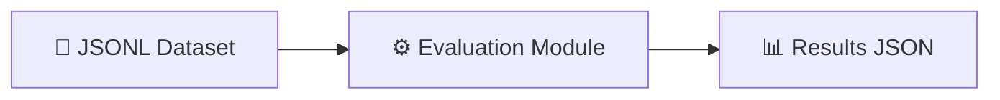
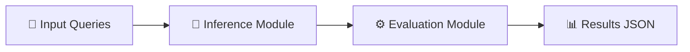
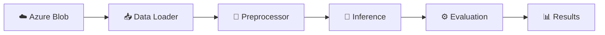

# Evaluation Framework using Azure AI Foundry

[](https://opensource.org/licenses/MIT)
[](https://www.python.org/downloads/)
[](https://azure.microsoft.com/en-us/products/ai-foundry)

A config-driven evaluation framework for **agentic systems** and **GenAI applications** built on Azure AI Foundry SDK. Get started in minutes with YAML-based experiment configuration.

## About This Framework

This framework provides two core capabilities for rapid AI evaluation:

1. **Simplified Evaluation SDK Integration** — Easily add both built-in Azure AI Foundry evaluators and custom metrics with minimal code
2. **Pipeline-Based Architecture** — Connect your experiments, inference modules, and data loaders through a configurable pipeline defined in YAML

Whether you're evaluating RAG applications, multi-agent systems, or custom GenAI workflows, this framework reduces boilerplate and accelerates iteration.

> **Note:** Pushing evaluation results to Azure AI Foundry dashboard is not currently supported, as the evaluation SDK requires key-based authentication. All evaluations run locally with results saved to JSON files.

## Key Features

| Feature | Description |
|---------|-------------|
| **🚀 Quick Setup** | Config-driven YAML files—swap datasets, models, or metrics instantly |
| **🔌 Plug-and-Play** | Modular architecture for custom data loaders, evaluators, and pipeline stages |
| **📊 Flexible Metrics** | Use Azure AI Foundry built-in evaluators or create custom ones |
| **🎯 Agentic Focus** | Purpose-built metrics for tool selection, multi-agent coordination, and recall@k |

---

## Table of Contents

- [Getting Started](#getting-started)
- [Samples](#samples)
- [Configuration Guide](#configuration-guide)
- [Creating New Evaluations](#creating-new-evaluations)
- [Evaluators Reference](#evaluators-reference)
- [Pipeline Architecture](#pipeline-architecture)
- [References](#references)

---

## Getting Started

### Prerequisites

- Python 3.11+ and Git
- Azure CLI installed and authenticated
- Azure AI Foundry project with GPT-4o deployment

### Quick Start

```bash
# 1. Clone and install
git clone https://github.com/Azure-Samples/Agentic-Evaluations.git
cd Agentic-Evaluations
uv sync
.venv\Scripts\activate  # Windows PowerShell
# source .venv/bin/activate  # Linux/macOS

# 2. Azure login
az login
az account set --subscription "<your-subscription-id>"

# 3. Configure environment
cp .env.template .env
# Edit .env with your Azure AI Foundry credentials:
#   EVAL_AZURE_OPENAI_ENDPOINT=https://<your-resource>.openai.azure.com/
#   EVAL_AZURE_OPENAI_MODEL=<your-deployment-name>
#   EVAL_AZURE_OPENAI_VERSION=2024-12-01-preview

# 4. Run a sample evaluation
python -m src.agent_evaluation.agentic_ops.runner --config_file src/evaluations/offline/genai_evaluation_foundry/experiment.yaml
```

**Results:** `src/evaluations/offline/<experiment_folder>/report/`

---

## Samples

| Sample | Description | Run Command |
|--------|-------------|-------------|
| [`genai_evaluation_foundry`](./src/evaluations/offline/genai_evaluation_foundry/README.md) | **Standard GenAI/RAG** - Built-in evaluators (Relevance, Coherence, Fluency) | `python -m src.agent_evaluation.agentic_ops.runner --config_file src/evaluations/offline/genai_evaluation_foundry/experiment.yaml` |
| [`agentic_evaluation`](./src/evaluations/offline/agentic_evaluation/README.md) | **Agentic Systems** - Agent invocation accuracy, recall@k, hallucination detection | `python -m src.agent_evaluation.agentic_ops.runner --config_file src/evaluations/offline/agentic_evaluation/experiment.yaml` |
| [`ai_judge_evaluation_custom`](./src/evaluations/offline/ai_judge_evaluation_custom/README.md) | **Custom AI Judge** - LLM-as-Judge with prompty templates | `python -m src.agent_evaluation.agentic_ops.runner --config_file src/evaluations/offline/ai_judge_evaluation_custom/experiment.yaml` |
| [`pipeline_experiment_evaluation`](./src/evaluations/offline/pipeline_experiment_evaluation/README.md) | **Full Pipeline** - Data loading → Inference → Evaluation | `python -m src.agent_evaluation.agentic_ops.runner --config_file src/evaluations/offline/pipeline_experiment_evaluation/experiment.yaml` |

---

## Configuration Guide

### experiment.yaml Structure

```yaml
app_name: Agentic-Evals
experiment_name: My_Evaluation

evaluation:
  run_local: True                    # Local execution (recommended)
  input_path: datasets/
  input_file: my_data.jsonl
  output_path: report/
  
  evaluators:                        # Evaluators to run
    relevance: "relevance_evaluator"
    coherence: "coherence_evaluator"
  
  evaluator_config:                  # Map dataset fields to evaluator inputs
    relevance:
      column_mapping:
        query: "${data.query}"
        response: "${data.response}"

pipeline:                            # Pipeline stages
  - base_path: evaluator
    module: eval_main.eval_main
    config_key: evaluation
```

**Key Points:**
- `${data.<field>}` syntax maps JSONL dataset fields to evaluator parameters
- Evaluator keys become column names in results
- See [Built-in Evaluators](#built-in-evaluators-azure-ai-foundry) for parameter requirements

---

## Creating New Evaluations

### 1. Copy a sample and prepare your dataset

```bash
cp -r src/evaluations/offline/genai_evaluation_foundry src/evaluations/offline/my_evaluation
```

Create a JSONL file in `datasets/`:
```jsonl
{"query": "What is the weather?", "response": "It's sunny and 72°F.", "context": "Weather data..."}
```

### 2. Register evaluators in `eval_factory.py`

```python
from azure.ai.evaluation import RelevanceEvaluator, CoherenceEvaluator

class EvaluatorFactory:
    EVALUATOR_FACTORIES = {
        "relevance_evaluator": RelevanceEvaluator,
        "coherence_evaluator": CoherenceEvaluator,
    }
```

### 3. Configure and run

Update `experiment.yaml` with your evaluators and column mappings, then:

```bash
python -m src.agent_evaluation.agentic_ops.runner --config_file src/evaluations/offline/my_evaluation/experiment.yaml
```

### Adding Custom Evaluators

```python
# evaluator/evaluator_repo/my_evaluator.py
class MyCustomEvaluator:
    def __call__(self, query, response, **kwargs):
        score = self.calculate_score(query, response)
        return {"my_metric": score}
```

Register in `eval_factory.py` and add to your `experiment.yaml`.

---

## Evaluators Reference

### Custom Agentic Metrics

| Metric | Output | Description |
|--------|--------|-------------|
| **Agent Invocation Accuracy** | True/False | Exact match of expected vs. selected agents |
| **Recall@K** | 0.0-1.0 | Expected agents found in top-K selections |
| **Agent Hallucination** | yes/no | Detects unnecessary agent invocations |

### Built-in Evaluators (Azure AI Foundry)

| Evaluator | Required Fields | Use Case |
|-----------|-----------------|----------|
| **RelevanceEvaluator** | query, response | Does response answer the query? |
| **FluencyEvaluator** | response | Grammar and language quality |
| **CoherenceEvaluator** | query, response | Logical flow and clarity |
| **GroundednessEvaluator** | response, context | Anti-hallucination check |
| **SimilarityEvaluator** | query, response, ground_truth | Match to expected output |
| **ContentSafetyEvaluator** | query, response | Harmful content detection |

📖 [Full Azure AI Foundry Evaluator Reference](https://learn.microsoft.com/en-us/azure/ai-foundry/how-to/develop/evaluate-sdk)

---

## Pipeline Architecture

The framework supports flexible pipeline configurations. Choose the pattern that fits your workflow:

### Pipeline 1: Evaluation Only
Use when you already have model responses and want to evaluate them.



### Pipeline 2: Inference + Evaluation
Use for end-to-end testing with your agent or model.



### Pipeline 3: Full Pipeline (Data Loading + Inference + Evaluation)
Use for production workflows with external data sources.



### Pipeline Configuration in YAML

```yaml
pipeline:
  - base_path: data_loader      # Stage 1: Load data
    module: loader.load_data
    config_key: data_config

  - base_path: inference        # Stage 2: Run inference
    module: agent.run_inference
    config_key: inference_config

  - base_path: evaluator        # Stage 3: Evaluate results
    module: eval_main.eval_main
    config_key: evaluation
```

Each pipeline stage is independently configurable—add, remove, or reorder stages as needed.

---

## References

- [Azure AI Evaluation SDK](https://learn.microsoft.com/en-us/python/api/overview/azure/ai-evaluation-readme?view=azure-python)
- [Azure AI Foundry Documentation](https://learn.microsoft.com/en-us/azure/ai-foundry/what-is-ai-foundry)
- [Agentic Evaluation Guide](https://learn.microsoft.com/en-us/azure/ai-foundry/how-to/develop/agent-evaluate-sdk)

---

## License

MIT License - see [LICENSE](LICENSE) for details.

## Contributing

This project welcomes contributions. See [CONTRIBUTING.md](CONTRIBUTING.md) for guidelines.

This project has adopted the [Microsoft Open Source Code of Conduct](https://opensource.microsoft.com/codeofconduct/).
