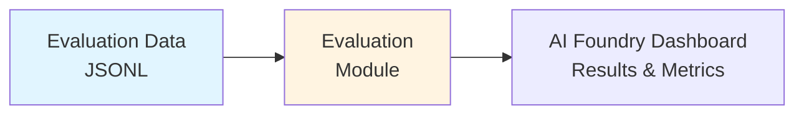
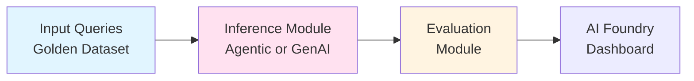
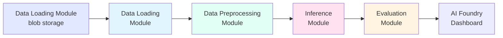

# Evaluation Framework using Azure AI Foundry

[](https://opensource.org/licenses/MIT)
[](https://www.python.org/downloads/)
[](https://azure.microsoft.com/en-us/products/ai-foundry)

## Making AI Evaluation Simple

A robust evaluation framework built for **fast, iterative experimentation** with both **agentic systems** and **GenAI applications** (including RAG). Powered by the Azure AI Foundry SDK, it streamlines the evaluation process—reducing setup and experimentation time from days to hours. The framework enables you to quickly configure, run, and compare experiments across datasets, models, and metrics, supporting both standard and custom evaluation workflows.

**🚀 Simple Setup & Experimentation**
- Get started in 2-3 steps with config-driven YAML files
- No complex boilerplate - just configure and run
- Swap datasets, models, or metrics instantly with minimum code changes

**🔌 Plug-and-Play Architecture**
- Add your own data loaders, preprocessors, and evaluators as modular components
- Extend the framework without modifying core infrastructure
- Organized pipeline stages driven by experiment configurations

**📊 Flexible Evaluation Metrics**
- Use Azure AI Foundry's **built-in evaluators** for standard metrics (relevance, coherence, fluency)
- Create **custom evaluators** for domain-specific or agent-level metrics
- Mix and match both types in a single evaluation run

**⚡ Optimized for Speed & Scale**
- **Local execution**: Fast, multi-threaded processing for quick iterations
- Results automatically flow to Azure AI Foundry dashboard for comparative analysis

**🎯 Purpose-Built for Experimenting Modern AI Systems**
- Evaluate agentic workflows (tool selection, multi-agent coordination, recall@k)
- Evaluate GenAI applications (RAG relevance, groundedness, response quality)
- Compare multiple experiments side-by-side to identify the best candidate for deployment


## Table of Contents

- [Evaluation Framework using Azure AI Foundry](#evaluation-framework-using-azure-ai-foundry)
  - [Making AI Evaluation Simple](#making-ai-evaluation-simple)
  - [Table of Contents](#table-of-contents)
  - [Pipeline Architecture](#pipeline-architecture)
    - [1. Evaluation Only Pipeline](#1-evaluation-only-pipeline)
    - [2. Inference + Evaluation Pipeline](#2-inference--evaluation-pipeline)
    - [3. Data Loading + Inference + Evaluation Pipeline](#3-data-loading--inference--evaluation-pipeline)
    - [Pipeline Components](#pipeline-components)
    - [Samples](#samples)
    - [Provided Evaluation Samples](#provided-evaluation-samples)
  - [Prerequisites](#prerequisites)
  - [Azure Services Used](#azure-services-used)
  - [Installation \& Setup](#installation--setup)
    - [1. Clone the Repository](#1-clone-the-repository)
    - [2. Install Dependencies](#2-install-dependencies)
    - [3. Install Azure CLI \& Login](#3-install-azure-cli--login)
    - [4. Configure Environment Variables](#4-configure-environment-variables)
    - [5. Run Sample Evaluations](#5-run-sample-evaluations)
  - [Folder Structure](#folder-structure)
    - [Understanding experiment.yaml Configuration](#understanding-experimentyaml-configuration)
  - [How to Create New Evaluations](#how-to-create-new-evaluations)
    - [Adding Custom Evaluators](#adding-custom-evaluators)
  - [Custom Evaluation Metrics for Agentic Systems](#custom-evaluation-metrics-for-agentic-systems)
  - [Built-in Evaluators (Azure AI Foundry)](#built-in-evaluators-azure-ai-foundry)
  - [Future Enhancements](#future-enhancements)
  - [References](#references)
  - [License](#license)
  - [Contributing](#contributing)

---


## Pipeline Architecture

The evaluation pipeline is modular and flexible—run just evaluation, or add inference and data loading as needed. Each stage is independently configurable, so you can adapt workflows, datasets, and metrics easily. Results integrate directly with the Azure AI Foundry dashboard for visualization.

### 1. Evaluation Only Pipeline
Use this when you already have model responses and want to evaluate them.



**Use Case**: Evaluate existing model outputs, compare different models, or test custom evaluators.

### 2. Inference + Evaluation Pipeline
Use this when you need to generate responses and evaluate them in one flow.



**Use Case**: End-to-end testing, Experimentation different prompts / models or continuous evaluation during development.

### 3. Data Loading + Inference + Evaluation Pipeline
Use this for complete automation from data storage to evaluation results.



**Use Case**: Production evaluation workflows, scheduled batch evaluations, or large-scale testing.

### Pipeline Components

The diagram shows a representation of a pipeline added to the yaml file


### Samples
### Provided Evaluation Samples

The repository includes several ready-to-use evaluation samples, each demonstrating a different evaluation scenario. Each sample folder contains its own detailed README for setup and usage instructions.

| Sample Folder                   | Description & Use Case                                                                                          | Key Features | More Info                |
|---------------------------------|----------------------------------------------------------------------------------------------------------------|--------------|--------------------------|
| `agentic_evaluation`            | **Agentic Systems Evaluation** - Measures agent invocation accuracy, recall@k, and tool-calling correctness. Purpose-built for multi-agent and autonomous systems. | • Sample dataset with 10 agent responses<br>• Custom evaluators: Invocation Accuracy, Recall@K, Agent Hallucination<br>• Built-in evaluators: Relevance, Task Adherence | [README](./src/evaluations/offline/agentic_evaluation/README.md) |
| `ai_judge_evaluation_custom`    | **Custom AI Judge (LLM-as-Judge)** - Create custom evaluation methodology for metrics like coherence and relevance using prompty templates. Perfect for domain-specific quality criteria. | • Sample RAG dataset<br>• Custom prompty templates for Coherence, Relevance, Fluency, Similarity<br>• Domain-specific rubrics (1-5 scale) | [README](./src/evaluations/offline/ai_judge_evaluation_custom/README.md) |
| `genai_evaluation_foundry`      | **Standard GenAI/RAG Evaluation** - Uses Azure AI Foundry's built-in evaluators (Relevance, Coherence, Fluency, Groundedness). Ideal for quick benchmarking and comparison. | • Sample dataset with 4 healthcare insurance queries<br>• Pre-configured with Fluency + Coherence evaluators<br>• Ready to run immediately | [README](./src/evaluations/offline/genai_evaluation_foundry/README.md) |
| `pipeline_experiment_evaluation`| **Complete Pipeline with Inference** -  inference → evaluation workflow for production-scale testing. | • Azure Blob integration<br>• Data preprocessing<br>• Batch evaluation | [README](./src/evaluations/offline/pipeline_experiment_evaluation/README.md) |

**Quick Start:**
1. Choose the sample that matches your use case
2. Copy the folder: `cp -r src/evaluations/offline/<sample_name> src/evaluations/offline/my_evaluation`
3. Update `experiment.yaml` with your dataset path and selected evaluators
4. Run: `python -m src.agent_evaluation.agentic_ops.runner --config_file src/evaluations/offline/my_evaluation/experiment.yaml`


## Prerequisites

- Azure Subscription with permissions
- Azure CLI installed and authenticated
- Azure AI Foundry project and GPT-4o deployment
- Python 3.11+
- Git
- Create Azure AI Foundry projects : **Hub and project or AI foundry project**.

## Azure Services Used

- **Azure AI Foundry** (evaluation and model hosting)
- **GPT-4o** - LLM as a judgment

## Installation & Setup

### 1. Clone the Repository

```bash
git clone https://github.com/Azure-Samples/Agentic-Evaluations.git
cd Agentic-Evaluations
```

### 2. Install Dependencies

```bash
uv sync

# Activate virtual environment
.venv\Scripts\activate         # PowerShell (Windows)
source .venv/bin/activate      # Linux/macOS
```

### 3. Install Azure CLI & Login

```bash
az login
az account set --subscription "<your-subscription-id>"
```

### 4. Configure Environment Variables

Create a `.env` file in the project root by copying the provided template:

```bash
cp .env.template .env
```

Edit the `.env` file to include your Azure AI Foundry credentials:

```env
# Required for all evaluations
EVAL_AZURE_OPENAI_KEY=<your-azure-openai-key>
EVAL_AZURE_OPENAI_VERSION=2024-12-01-preview
EVAL_AZURE_OPENAI_ENDPOINT=https://<your-resource>.openai.azure.com/
EVAL_AZURE_OPENAI_MODEL=<your-deployment-name>

# Optional: For pushing results to Azure AI Foundry dashboard
EVAL_AZURE_FOUNDRY_CONNECTION_STRING=<your-ai-foundry-connection-string>
```

### 5. Run Sample Evaluations

Test the framework with provided sample data:

**GenAI Evaluation (Built-in Evaluators):**
```bash
python -m src.agent_evaluation.agentic_ops.runner --config_file src/evaluations/offline/genai_evaluation_foundry/experiment.yaml
```

**Agentic Evaluation (Custom Metrics):**
```bash
python -m src.agent_evaluation.agentic_ops.runner --config_file src/evaluations/offline/agentic_evaluation/experiment.yaml
```

**Custom AI Judge Evaluation:**
```bash
python -m src.agent_evaluation.agentic_ops.runner --config_file src/evaluations/offline/ai_judge_evaluation_custom/experiment.yaml
```

**Results Location:**
- Local results: `src/evaluations/offline/<evaluation_name>/report/`
- Azure AI Foundry dashboard: Check `studio_url` in results JSON (if `run_local: False`)


## Folder Structure

```text
src/
├── agent_evaluation/
│   └── agentic_ops/                    # Core framework infrastructure
│       ├── runner.py                   # Pipeline orchestration
│       ├── run_eval.py                 # Evaluation execution engine
│       ├── base_evaluator.py           # Base class for custom evaluators
│       ├── client.py                   # LLM client utilities
│       └── README.md                   # Infrastructure documentation
│
└── evaluations/
    └── offline/
        ├── agentic_evaluation/         # Agentic systems evaluation
        │   ├── datasets/               # Sample: 10 home automation agent interactions
        │   │   └── agent_response_sample_data.jsonl  # Fields: query, expected_agents, selected_agents, response
        │   ├── evaluator/
        │   │   ├── eval_main.py        # Main evaluation script
        │   │   └── evaluator_repo/     # Agent-specific custom evaluators
        │   │       ├── evaluate_agent_invoked.py  # Invocation Accuracy, Recall@K
        │   │       └── eval_utils/     # Metric calculation utilities
        │   ├── eval_factory.py         # Agent evaluators + Relevance + Task Adherence
        │   ├── experiment.yaml         # Agentic eval configuration
        │   ├── report/                 # Evaluation results
        │   └── README.md               # Detailed setup guide
        │
        ├── ai_judge_evaluation_custom/ # Custom AI Judge (LLM-as-judge)
        │   ├── datasets/               # Sample: 4 query-response examples
        │   │   └── rag_sample.jsonl    # Fields: query, response, ground_truth
        │   ├── evaluator/
        │   │   ├── eval_main.py        # Main evaluation script
        │   │   └── evaluator_repo/     # Custom AI Judge evaluators
        │   │       ├── coherence.py    # Coherence evaluator
        │   │       ├── relevance.py    # Relevance evaluator
        │   │       ├── fluency.py      # Fluency evaluator
        │   │       ├── similarity.py   # Similarity evaluator
        │   │       ├── prompts/        # Prompty template files (.prompty)
        │   │       └── eval_utils/     # Evaluation utilities
        │   ├── eval_factory.py         # Custom evaluators registered
        │   ├── experiment.yaml         # AI Judge eval configuration
        │   ├── report/                 # Evaluation results
        │   └── README.md               # Detailed setup guide
        │
        ├── genai_evaluation_foundry/   # Azure AI Foundry built-in evaluators
        │   ├── datasets/               # Sample: 4 query-response examples
        │   ├── evaluator/
        │   ├── eval_factory.py
        │   ├── experiment.yaml
        │   └── README.md
        │
        ├── pipeline_experiment_evaluation/  # Full pipeline: Data → Inference → Eval
        │   ├── datasets/
        │   ├── evaluator/
        │   ├── experiment/             # Inference modules
        │   ├── experiment.yaml
        │   └── README.md
        │
        ├── golden_dataset/             # Reference datasets
        │   └── raw_data/
        │       └── DataForEvals/
        │
        └── utils/                      # Shared utilities
            ├── blobFileUpload.py       # Azure Blob storage integration
            ├── constants.py            # Shared constants
            └── file_operations.py      # File handling utilities
```

### Understanding experiment.yaml Configuration

The `experiment.yaml` file is the central configuration for your evaluation. Here's what each section controls:

```yaml
app_name: Agentic-Evals
version: 1.0.0
experiment_name: My_Evaluation_Experiment  # Appears in results and dashboard

evaluation:  # Evaluation configuration
  run_local: True  # False = push results to Azure AI Foundry dashboard
  input_path: src/evaluations/offline/my_evaluation/datasets/
  input_file: my_data.jsonl  # Your JSONL dataset
  output_path: src/evaluations/offline/my_evaluation/report/
  
  column_mapping:  # Optional: Map dataset columns to standard names
    user_id: "${data.conversation_id}"
  
  evaluators:  # List evaluators to run
    relevance_score: "relevance_evaluator"  # Format: <output_name>: "<factory_key>"
    groundedness_score: "groundedness_evaluator"
  
  evaluator_config:  # Configure each evaluator's inputs
    relevance_score:
      column_mapping:  # Map dataset fields to evaluator parameters
        query: "${data.query}"  # ${data.<field_name>} syntax
        response: "${data.response}"
    
    groundedness_score:
      column_mapping:
        response: "${data.response}"
        context: "${data.context}"

pipeline:  # Pipeline stages to execute
  - base_path: evaluator  # Folder name
    module: eval_main.eval_main  # Python module to run
    config_key: evaluation  # Maps to 'evaluation' config above
```

**Key Points:**
- **run_local: True** - Fast local execution, results in JSON file
- **run_local: False** - Pushes to Azure AI Foundry dashboard (requires `EVAL_AZURE_FOUNDRY_CONNECTION_STRING` in .env)
- **evaluators** - Keys become column names in results
- **evaluator_config** - Must match evaluator parameter requirements (see [Built-in Evaluators](#built-in-evaluators-azure-ai-foundry))
- **column_mapping** - `${data.<field>}` references fields in your JSONL dataset


## How to Create New Evaluations

Follow these steps to set up a new agentic evaluation:

1. **Copy a Relevant Sample Folder**  
   ```bash
   cp -r src/evaluations/offline/agentic_evaluation src/evaluations/offline/my_agentic_evaluation
   cd src/evaluations/offline/my_agentic_evaluation
   ```

2. **Prepare Your Dataset**  
   Create a JSONL file in `datasets/` with required fields for agentic evaluation:
   ```jsonl
   {"query": "Turn on the TV and switch to channel 5", "expected_agents": ["tv_agent"], "selected_agents": ["tv_agent"], "response": "I've turned on the TV and switched to channel 5 for you."}
   {"query": "What's the weather today and set AC to 72 degrees", "expected_agents": ["weather_agent", "ac_agent"], "selected_agents": ["weather_agent", "ac_agent"], "response": "The current weather is sunny and 68°F. I've set your AC to 72 degrees."}
   {"query": "Check weather and turn on TV", "expected_agents": ["weather_agent", "tv_agent"], "selected_agents": ["weather_agent", "tv_agent", "ac_agent"], "response": "Today's weather is partly cloudy with a high of 75°F. I've turned on the TV for you."}
   ```
   
   **Required Fields for Agentic Evaluation:**
   - `query`: User's input/request
   - `expected_agents`: List of agents that should be invoked
   - `selected_agents`: List of agents that were actually invoked
   - `response`: Agent's response to the query

3. **Select Your Evaluators**  
   Decide which metrics you need:
   - **Custom Agentic Metrics**: Agent Invocation Accuracy, Agent Hallucination
   - **Built-in Azure Metrics**: Relevance, Coherence, Fluency
   - Mix custom and built-in evaluators as needed

4. **Update `eval_factory.py`**  
   Register your selected evaluators:
   ```python
   from azure.ai.evaluation import RelevanceEvaluator
   from .evaluator.evaluator_repo.evaluate_agent_invoked import AgentInvokedEvaluator
   
   class EvaluatorFactory:
       EVALUATOR_FACTORIES = {
           "agent_invoked_evaluator": AgentInvokedEvaluator,
           "relevance_evaluator": RelevanceEvaluator,
       }
   ```

5. **Configure `experiment.yaml`**  
   ```yaml
   evaluation:
     run_local: True  # Set False to push to Azure AI Foundry dashboard
     input_path: src/evaluations/offline/my_agentic_evaluation/datasets/
     input_file: my_agent_data.jsonl
     output_path: src/evaluations/offline/my_agentic_evaluation/report/
     
     evaluators:
       agent_invocation_accuracy: "agent_invoked_evaluator"
       relevance_score: "relevance_evaluator"
     
     evaluator_config:
       agent_invocation_accuracy:
         column_mapping:
           expected_agents: "${data.expected_agents}"
           selected_agents: "${data.selected_agents}"
       relevance_score:
         column_mapping:
           query: "${data.query}"
           response: "${data.response}"
   ```

6. **Run Your Evaluation**  
   ```bash
   python -m src.agent_evaluation.agentic_ops.runner --config_file src/evaluations/offline/my_agentic_evaluation/experiment.yaml
   ```

7. **Review Results**  
   - Local: Check `report/<experiment_name>.json`
   - Azure dashboard: Open `studio_url` from results JSON

### Adding Custom Evaluators

To create domain-specific evaluation metrics:

1. **Create evaluator class** in `evaluator/evaluator_repo/my_evaluator.py`:
   ```python
   class MyCustomEvaluator:
       def __init__(self):
           pass
       
       def __call__(self, query, response, **kwargs):
           # Your evaluation logic here
           score = self.calculate_score(query, response)
           return {"my_metric": score}
   ```

2. **Register in `eval_factory.py`**:
   ```python
   from .evaluator.evaluator_repo.my_evaluator import MyCustomEvaluator
   
   EVALUATOR_FACTORIES = {
       "my_custom_evaluator": MyCustomEvaluator,
   }
   ```

3. **Add to `experiment.yaml`**:
   ```yaml
   evaluators:
     my_metric_score: "my_custom_evaluator"
   
   evaluator_config:
     my_metric_score:
       column_mapping:
         query: "${data.query}"
         response: "${data.response}"
   ```

**See sample implementations:**
- Custom logic: `agentic_evaluation/evaluator/evaluator_repo/`
- AI Judge (prompty): `ai_judge_evaluation_custom/evaluator/evaluator_repo/`


## Custom Evaluation Metrics for Agentic Systems

The framework includes purpose-built metrics for evaluating agent behavior:

| Metric                          | Formula | Output | Description                                                       |
|---------------------------------|---------|--------|-------------------------------------------------------------------|
| **Agent Invocation Accuracy**   | `set(expected) == set(predicted)` | True/False | Exact match - did system invoke exactly the right agents? |
| **Recall@K**                    | `len(set(expected) ∩ set(predicted[:k])) / len(expected)` | 0.0-1.0 | Are expected agents in top-K selections? (K=1,2,3) |
| **Agent Hallucination**         | `len(predicted) > len(expected)` | "yes"/"no" | Did system call extra agents unnecessarily? (over-invocation) |

**Example:**
```python
Expected agents: ["weather_agent", "location_agent"]
Selected agents: ["weather_agent", "location_agent", "calendar_agent"]

Results:
- Invocation Accuracy: False  # Extra agent called
- Recall@3: 1.0              # Both expected agents in top 3
- Agent Hallucination: "yes" # 3 > 2, over-invoked
```

**Use Cases:**
- Multi-agent orchestration quality
- Tool selection accuracy
- Agent routing optimization
- Reducing unnecessary agent invocations

**See sample:** `src/evaluations/offline/agentic_evaluation/`


## Built-in Evaluators (Azure AI Foundry)

Azure AI Foundry provides production-ready evaluators. Each evaluator has specific parameter requirements:

| Evaluator                     | Query       | Response    | Context     | Ground Truth | Conversation | Use Case |
|------------------------------|-------------|-------------|-------------|---------------|--------------|----------|
| **RelevanceEvaluator**       | Required    | Required    | N/A         | N/A           | Yes          | Does response answer the query? |
| **FluencyEvaluator**         | N/A         | Required    | N/A         | N/A           | Yes          | Grammar and language quality |
| **CoherenceEvaluator**       | Required    | Required    | N/A         | N/A           | Yes          | Logical flow and clarity |
| **GroundednessEvaluator**    | Optional    | Required    | Required    | N/A           | Yes          | Stays within provided context (anti-hallucination) |
| **SimilarityEvaluator**      | Required    | Required    | N/A         | Required      | No           | Match to expected ground truth |
| **F1ScoreEvaluator**         | N/A         | Required    | N/A         | Required      | No           | Token-level precision/recall |
| **RougeScoreEvaluator**      | N/A         | Required    | N/A         | Required      | No           | N-gram overlap metrics |
| **ContentSafetyEvaluator**   | Required    | Required    | N/A         | N/A           | Yes          | Detect harmful content |
| **ViolenceEvaluator**        | Required    | Required    | N/A         | N/A           | Yes          | Violence detection |
| **SexualEvaluator**          | Required    | Required    | N/A         | N/A           | Yes          | Sexual content detection |
| **SelfHarmEvaluator**        | Required    | Required    | N/A         | N/A           | Yes          | Self-harm detection |
| **HateUnfairnessEvaluator**  | Required    | Required    | N/A         | N/A           | Yes          | Hate speech detection |

**Common Mistakes:**
- ❌ Adding `query` to FluencyEvaluator (only needs `response`)
- ❌ Forgetting `context` for GroundednessEvaluator
- ❌ Forgetting `ground_truth` for SimilarityEvaluator

**Dataset Requirements:**
- **RAG Systems**: Need `query`, `response`, `context` fields
- **Benchmark Testing**: Need `query`, `response`, `ground_truth` fields
- **Quality Testing**: Need `query`, `response` fields

*For full documentation, refer to the [AI Foundry Evaluator Reference](https://learn.microsoft.com/en-us/azure/ai-foundry/how-to/develop/evaluate-sdk)*

## Future Enhancements

- Multi-turn conversation evaluation
- More advanced visualization and comparative dashboards

## References
- [Azure AI Evaluatation SDK](https://learn.microsoft.com/en-us/python/api/overview/azure/ai-evaluation-readme?view=azure-python)
- [Azure AI Foundry Documentation](https://learn.microsoft.com/en-us/azure/ai-foundry/what-is-ai-foundry)
- [Agentic Evaluation in Azure](https://learn.microsoft.com/en-us/azure/ai-foundry/how-to/develop/agent-evaluate-sdk)
- [Built-in Evaluator Reference](https://learn.microsoft.com/en-us/azure/ai-foundry/how-to/develop/evaluate-sdk)

## License

This project is licensed under the MIT License - see the [LICENSE](LICENSE) file for details.

## Contributing

This project welcomes contributions and suggestions. Most contributions require you to agree to a Contributor License Agreement (CLA) declaring that you have the right to, and actually do, grant us the rights to use your contribution. For details, visit https://cla.opensource.microsoft.com.

When you submit a pull request, a CLA bot will automatically determine whether you need to provide a CLA and decorate the PR appropriately (e.g., status check, comment). Simply follow the instructions provided by the bot. You will only need to do this once across all repos using our CLA.

This project has adopted the [Microsoft Open Source Code of Conduct](https://opensource.microsoft.com/codeofconduct/). For more information see the [Code of Conduct FAQ](https://opensource.microsoft.com/codeofconduct/faq/) or contact [opencode@microsoft.com](mailto:opencode@microsoft.com) with any additional questions or comments.
