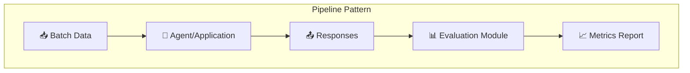
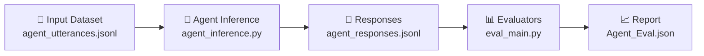

# Experiment & Evaluation Pipeline for AI Agents

## About This Pattern

This sample demonstrates a **sequential pipeline pattern** where:
1. An agent (or any AI application) processes a batch of queries
2. The responses are passed to an evaluation module for generating metrics



This pattern is useful for:
- **Batch evaluation** of agent performance
- **Offline analysis** of production responses

## Overview

This framework demonstrates a **complete end-to-end pipeline** for AI agent experimentation and evaluation:

1. **Experiment Stage (Inference)**: Generate agent responses for test queries
2. **Evaluation Stage**: Assess responses using Azure AI Foundry evaluators

**Key Benefits:**
- **Modular**: Inference and evaluation are independent stages
- **Reusable**: Evaluate the same responses with different metrics
- **Flexible**: Swap agent implementations without changing evaluation code

## Pipeline Architecture



## Quick Start

### 1. Understand the Code Flow

Open `experiment/agent_inference.py` and review how `simulate_agent_response()` is called in the main function:

```python
def inference_main(config: dict, args=None) -> None:
    # Step 1: Setup file paths
    input_path, output_path = get_file_paths(config)
    
    # Step 2: Prepare output file
    prepare_output_file(output_path)
    
    # Step 3: Load queries from dataset
    queries = load_queries_from_jsonl(str(input_path))
    
    # Step 4: Process each query
    for query_data in queries:
        query = query_data.get('query', '')
        session_id = query_data.get('session_id', '')
        
        # TODO: Replace simulate_agent_response() with your agent logic
        response = simulate_agent_response(query)
        
        # Save result
        save_result(output_path, query, session_id, response)
```

### 2. Configure Your Agent

Replace the `simulate_agent_response()` function with your implementation. This can be:

**Option A: Direct agent/model call**
```python
def simulate_agent_response(query: str) -> str:
    # Call your local agent or LLM
    return your_agent.generate(query)
```

**Option B: HTTP-based request**
```python
def simulate_agent_response(query: str) -> str:
    # Call your agent service via HTTP
    response = requests.post(
        "http://localhost:8000/chat",
        json={"message": query}
    )
    return response.json()["response"]
```

### 3. Run the Pipeline

```bash
python -m src.agent_evaluation.agentic_ops.runner --config_file src/evaluations/offline/pipeline_experiment_evaluation/experiment.yaml
```

This runs both stages:
- **Stage 1**: Processes queries from `agent_utterances.jsonl` → saves to `agent_responses.jsonl`
- **Stage 2**: Evaluates responses → generates report


## Configuration

### experiment.yaml Structure

```yaml
# Stage 1: Inference settings
experiment:
  input_path: src/evaluations/offline/pipeline_experiment_evaluation/datasets/
  input_file: agent_utterances.jsonl
  output_path: src/evaluations/offline/pipeline_experiment_evaluation/datasets/
  output_file: agent_responses.jsonl

# Stage 2: Evaluation settings
evaluation:
  run_local: False  # True = local only, False = push to Azure AI Foundry
  input_path: src/evaluations/offline/pipeline_experiment_evaluation/datasets/
  input_file: agent_responses.jsonl
  output_path: src/evaluations/offline/reports/
  
  evaluators:
    relevance_score: "relevance_evaluator"
    task_adherence_score: "task_adherence_evaluator"
  
  evaluator_config:
    relevance_score:
      column_mapping:
        query: "${data.query}"
        response: "${data.response}"

# Pipeline stages (executed in order)
pipeline:
  - base_path: experiment
    module: agent_inference.inference_main
    config_key: experiment
  - base_path: evaluator
    module: eval_main.eval_main
    config_key: evaluation
```

### Running Individual Stages

**Run only inference** (comment out evaluation in pipeline):
```yaml
pipeline:
  - base_path: experiment
    module: agent_inference.inference_main
    config_key: experiment
  # - base_path: evaluator
  #   module: eval_main.eval_main
  #   config_key: evaluation
```

**Run only evaluation** (comment out experiment in pipeline) - useful for re-evaluating existing responses with different metrics.

## Evaluation Metrics

**Configured evaluators:**
- **Relevance**: How well the response addresses the query (1-5)
- **Task Adherence**: Instruction following and constraint adherence (1-5)

**Other available evaluators:** Tool Call Accuracy, Intent Resolution, Coherence, Groundedness, Fluency, Similarity, F1 Score

> See [Azure AI Foundry documentation](https://learn.microsoft.com/azure/ai-studio/how-to/evaluate-generative-ai-app) for complete evaluator list.

## Dataset Format

**Input (agent_utterances.jsonl):**
```json
{"query": "How is the weather in Seattle?", "session_id": "session-1"}
```

**Output (agent_responses.jsonl):**
```json
{"query": "How is the weather in Seattle?", "session_id": "session-1", "response": "Cloudy, 58°F."}
```

## Prerequisites

1. **Azure AI Foundry** - Project configured with Azure OpenAI deployment
2. **Environment variables** - See main README
3. **Dataset** - Input JSONL file at configured path

## Folder Structure

```
pipeline_experiment_evaluation/
├── experiment/                    # Stage 1: Inference
│   ├── agent_inference.py        # Main inference (customize simulate_agent_response)
│   └── experiment_utils/         # Helper functions
├── datasets/                      # Input/output data
├── evaluator/                     # Stage 2: Evaluation
├── report/                        # Generated reports
└── experiment.yaml               # Pipeline configuration
```

## Resources

- [Azure AI Foundry Evaluation Docs](https://learn.microsoft.com/azure/ai-studio/how-to/evaluate-generative-ai-app)
- [Built-in Evaluators Reference](https://learn.microsoft.com/azure/ai-studio/how-to/evaluate-generative-ai-app#built-in-evaluators)

## Data Provenance

All sample datasets included in this repository are **fully synthetic**. They use fictional entities (Northwind Health, Contoso) and simulated agent interactions (smart-home device controls, weather lookups). No real customer data, personally identifiable information, or production telemetry is included in any dataset.
