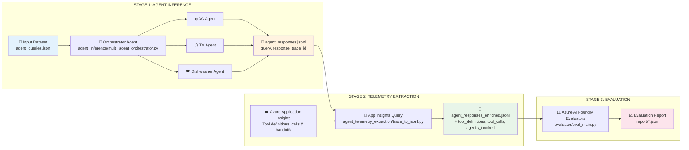

# Multi-Agent Orchestrator Evaluation Pipeline

## Overview

This framework demonstrates a **complete end-to-end pipeline** for multi-agent orchestrator experimentation and evaluation. The pipeline consists of three stages:

1. **Agent Inference**: Run a multi-agent orchestrator on queries using Microsoft Agent Framework
2. **Telemetry Extraction**: Enrich responses with tool call and agent handoff data from Azure Application Insights
3. **Evaluation**: Assess agent performance using Azure AI Foundry evaluators

> [!IMPORTANT]
> **Stage 1 (Agent Inference) requires [Microsoft Agent Framework](https://github.com/microsoft/agent-framework).** The orchestrator and all device agents are built with this SDK. Install it before running the full pipeline: `pip install agent-framework`.

The orchestrator agent routes user requests to specialized device agents (AC, TV, Dishwasher) and combines their responses into a single coherent reply.

## Evaluation Pipeline Flow



**Pipeline Flow:**

1. **Agent Inference** → Runs orchestrator on queries; orchestrator delegates to device agents and combines responses
2. **Telemetry Extraction** → Queries Application Insights to extract tool definitions, tool calls, and agent handoffs
3. **Evaluation** → Applies Azure AI Foundry evaluators (Relevance, TaskAdherence, ToolCallAccuracy)

## Architecture

### Orchestrator Pattern

The orchestrator agent receives all user requests and decides which device agent(s) to invoke:

- **Single-agent queries**: Routed to one device agent (e.g., "Turn on the AC" → AC Agent)
- **Multi-agent queries**: Routed to multiple device agents in parallel (e.g., "Turn on AC and turn off TV" → AC Agent + TV Agent)

### Device Agents

| Agent | Description | Tools |
|-------|-------------|-------|
| **AC Agent** | Controls the air conditioner | `turn_ac_on`, `turn_ac_off`, `set_ac_temperature`, `set_ac_mode`, `get_ac_status` |
| **TV Agent** | Controls the television | `turn_tv_on`, `turn_tv_off`, `set_tv_channel`, `set_tv_volume`, `get_tv_status` |
| **Dishwasher Agent** | Controls the dishwasher | `start_dishwasher`, `stop_dishwasher`, `get_dishwasher_status`, `set_dishwasher_delay` |

## Pipeline Configuration

### Understanding the Three-Stage Pipeline

The pipeline is defined in `experiment.yaml` and consists of three sequential stages:

#### Stage 1: Agent Inference

Runs the orchestrator agent on queries from the input dataset, routing to device agents and capturing combined responses with trace IDs.

#### Stage 2: Telemetry Extraction

Queries Azure Application Insights to extract tool definitions, tool calls, and agent handoff information for each trace.

#### Stage 3: Evaluation

Applies Azure AI Foundry evaluators to assess the quality of responses and tool call accuracy.

### Configuring `experiment.yaml`

#### 1. Agent Inference Configuration

```yaml
agent_inference:
  input_path: src/evaluations/offline/pipeline_multi_agent_evaluation/datasets/
  input_file: agent_queries.json
  output_path: src/evaluations/offline/pipeline_multi_agent_evaluation/datasets/
  output_file: agent_responses.jsonl
```

#### 2. Telemetry Extraction Configuration

```yaml
agent_telemetry_extraction:
  delay_seconds: 60
  input_path: src/evaluations/offline/pipeline_multi_agent_evaluation/datasets/
  input_file: agent_responses.jsonl
  output_path: src/evaluations/offline/pipeline_multi_agent_evaluation/datasets/
  output_file: agent_responses_enriched.jsonl
```

#### 3. Evaluation Configuration

```yaml
evaluation:
  run_local: True
  input_path: src/evaluations/offline/pipeline_multi_agent_evaluation/datasets/
  input_file: agent_responses_enriched.jsonl
  output_path: src/evaluations/offline/pipeline_multi_agent_evaluation/report/

  evaluators:
    relevance_score: "relevance_evaluator"
    task_adherence_score: "task_adherence_evaluator"
    tool_call_accuracy_score: "tool_call_accuracy_evaluator"

  evaluator_config:
    relevance_score:
      column_mapping:
        query: "${data.query}"
        response: "${data.response}"
    task_adherence_score:
      column_mapping:
        query: "${data.query}"
        response: "${data.response}"
    tool_call_accuracy_score:
      column_mapping:
        query: "${data.query}"
        tool_definitions: "${data.tool_definitions}"
        tool_calls: "${data.tool_calls}"
        response: "${data.response}"
```

#### 4. Pipeline Configuration

```yaml
pipeline:
  - base_path: agent_inference
    module: multi_agent_orchestrator.inference_main
    config_key: agent_inference
  - base_path: agent_telemetry_extraction
    module: trace_to_jsonl.get_trace_main
    config_key: agent_telemetry_extraction
  - base_path: evaluator
    module: eval_main.eval_main
    config_key: evaluation
```

## Evaluation Metrics

This pipeline uses Azure AI Foundry evaluators configured in `eval_factory.py`:

### Available Evaluators

| Evaluator | Description | Required Fields |
|-----------|-------------|-----------------|
| **RelevanceEvaluator** | Measures how well the response addresses the query (1-5) | `query`, `response` |
| **TaskAdherenceEvaluator** | Evaluates instruction following and constraint adherence (1-5) | `query`, `response` |
| **ToolCallAccuracyEvaluator** | Measures tool invocation correctness | `query`, `response`, `tool_calls`, `tool_definitions` |

## Dataset Format

### Input Dataset (agent_queries.json)

```json
{
  "single_agent": [
    {
      "id": "single_001",
      "query": "Turn on my AC.",
      "expected_agents": ["ACAgent"],
      "description": "Simple AC power on request"
    }
  ],
  "multi_agent": [
    {
      "id": "multi_001",
      "query": "Switch my AC on and turn off the TV.",
      "expected_agents": ["ACAgent", "TVAgent"],
      "description": "AC power on + TV power off"
    }
  ]
}
```

### Enriched Output (agent_responses_enriched.jsonl)

Each line contains:

```json
{
  "id": "single_001",
  "query": "Turn on my AC.",
  "response": "The AC has been turned on.",
  "trace_id": "abc123...",
  "category": "single_agent",
  "expected_agents": ["ACAgent"],
  "agents_invoked": ["ACAgent"],
  "tool_calls": [{"type": "tool_call", "name": "turn_ac_on"}],
  "agent_name": "OrchestratorAgent",
  "tool_definitions": [{"id": "turn_ac_on", "name": "turn_ac_on", "description": "..."}]
}
```

## Running the Pipeline

### Prerequisites

- Python 3.10+
- Azure CLI authenticated (`az login`)
- Environment variables set in `.env`:
  - `APPLICATIONINSIGHTS_CONNECTION_STRING` - for telemetry
  - `APPLICATION_INSIGHTS_WORKSPACE_ID` - for trace extraction

### Run Full Pipeline

```bash
python -m src.agent_evaluation.agentic_ops.runner --config_file src/evaluations/offline/pipeline_multi_agent_evaluation/experiment.yaml
```

### Run Individual Stages

**Stage 1 - Agent Inference (standalone):**

```bash
python src/evaluations/offline/pipeline_multi_agent_evaluation/agent_inference/multi_agent_orchestrator.py
```

**Stage 2 - Telemetry Extraction (standalone):**

```bash
python src/evaluations/offline/pipeline_multi_agent_evaluation/agent_telemetry_extraction/trace_to_jsonl.py
```
