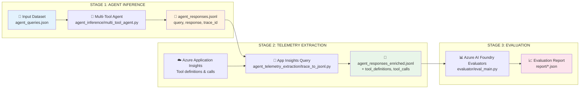

# Multi-Tool Agent Evaluation Pipeline

## Overview

This framework demonstrates a **complete end-to-end pipeline** for multi-tool AI agent experimentation and evaluation. The pipeline consists of three stages:

1. **Agent Inference**: Run a multi-tool agent on queries using Microsoft Agent Framework
2. **Telemetry Extraction**: Enrich responses with tool call data from Azure Application Insights
3. **Evaluation**: Assess agent performance using Azure AI Foundry evaluators

This modular pipeline architecture allows you to:
- **Separate concerns**: Keep inference, telemetry extraction, and evaluation independent
- **Reuse evaluations**: Run evaluations on pre-collected responses without re-running inference
- **Track tool usage**: Capture actual tool calls and definitions from agent telemetry
- **Comprehensive metrics**: Evaluate response quality AND tool call accuracy

## Evaluation Pipeline Flow



**Pipeline Flow:**
1. **Agent Inference** → Runs multi-tool agent on queries, captures responses and trace IDs
2. **Telemetry Extraction** → Queries Application Insights to extract tool definitions and tool calls
3. **Evaluation** → Applies Azure AI Foundry evaluators (Relevance, TaskAdherence, ToolCallAccuracy)

## Why Build Pipelines?

**Modular Design Benefits:**
- **Separation of Concerns**: Inference, telemetry, and evaluation are independent stages
- **Observability**: Full traceability from queries → tool calls → responses → evaluation scores
- **Flexibility**: Run any stage independently or skip stages using pre-collected data
- **Production Ready**: Same pipeline can evaluate production telemetry offline

**Example Use Cases:**
1. Run inference once, try multiple evaluation configurations
2. Collect responses from production, evaluate offline
3. Compare different agent versions using the same evaluation metrics
4. Analyze tool usage patterns across different query types


## Pipeline Configuration

### Understanding the Three-Stage Pipeline

The pipeline is defined in `experiment.yaml` and consists of three sequential stages:

#### Stage 1: Agent Inference
Runs the multi-tool agent on queries from the input dataset, capturing responses and trace IDs.

#### Stage 2: Telemetry Extraction
Queries Azure Application Insights to extract tool definitions and tool calls for each trace, enriching the response data.

#### Stage 3: Evaluation
Applies Azure AI Foundry evaluators to assess the quality of responses and tool call accuracy.

### Configuring `experiment.yaml`

#### 1. Agent Inference Configuration

```yaml
agent_inference:
  input_path: src/evaluations/offline/pipeline_multi_tool_agent_evaluation/datasets/
  input_file: agent_queries.json          # Input queries with expected tools
  output_path: src/evaluations/offline/pipeline_multi_tool_agent_evaluation/datasets/
  output_file: agent_responses.jsonl      # Output: query + response + trace_id
```

#### 2. Telemetry Extraction Configuration

```yaml
agent_telemetry_extraction:
  delay_seconds: 60                       # Wait for App Insights data ingestion
  input_path: src/evaluations/offline/pipeline_multi_tool_agent_evaluation/datasets/
  input_file: agent_responses.jsonl       # From Stage 1
  output_path: src/evaluations/offline/pipeline_multi_tool_agent_evaluation/datasets/
  output_file: agent_responses_enriched.jsonl  # Enriched with tool data
```

#### 3. Evaluation Configuration

```yaml
evaluation:
  run_local: True                         # True = local, False = Azure AI Foundry
  input_path: src/evaluations/offline/pipeline_multi_tool_agent_evaluation/datasets/
  input_file: agent_responses_enriched.jsonl   # From Stage 2
  output_path: src/evaluations/offline/pipeline_multi_tool_agent_evaluation/report/
  
  evaluators:
    relevance_score: "relevance_evaluator"
    task_adherence_score: "task_adherence_evaluator"
    tool_call_accuracy_score: "tool_call_accuracy_evaluator"
  
  evaluator_config:
    relevance_score:
      column_mapping:
        query: "${data.query}"
        response: "${data.response}"
    task_adherence_score:
      column_mapping:
        query: "${data.query}"
        response: "${data.response}"
    tool_call_accuracy_score:
      column_mapping:
        query: "${data.query}"
        tool_definitions: "${data.tool_definitions}"
        tool_calls: "${data.tool_calls}"
        response: "${data.response}"
```

#### 4. Pipeline Configuration

```yaml
pipeline:
  - base_path: agent_inference
    module: multi_tool_agent.inference_main
    config_key: agent_inference
  - base_path: agent_telemetry_extraction
    module: trace_to_jsonl.get_trace_main
    config_key: agent_telemetry_extraction
  - base_path: evaluator
    module: eval_main.eval_main
    config_key: evaluation
```

## Multi-Tool Agent

The agent (`agent_inference/multi_tool_agent.py`) is built using **Microsoft Agent Framework** with the following tools:

| Tool | Description |
|------|-------------|
| `get_weather` | Get weather for a location |
| `get_current_datetime` | Get current date and time |
| `calculate_sum` | Sum a list of numbers |
| `calculate_product` | Multiply a list of numbers |
| `convert_temperature` | Convert between Celsius, Fahrenheit, Kelvin |
| `count_words` | Count words, characters, sentences in text |
| `generate_uuid` | Generate a random UUID |
| `format_json` | Format JSON with indentation |

The agent uses **Azure OpenAI** as the chat client and instruments all calls with **OpenTelemetry** for observability.

## Evaluation Metrics

This pipeline uses Azure AI Foundry evaluators configured in `eval_factory.py`:

### Available Evaluators

| Evaluator | Description | Required Fields |
|-----------|-------------|-----------------|
| **RelevanceEvaluator** | Measures how well the response addresses the query (1-5) | `query`, `response` |
| **TaskAdherenceEvaluator** | Evaluates instruction following and constraint adherence (1-5) | `query`, `response` |
| **ToolCallAccuracyEvaluator** | Measures tool invocation correctness | `query`, `response`, `tool_calls`, `tool_definitions` |

### Adding More Evaluators

To add new evaluators, update `eval_factory.py`:

```python
from azure.ai.evaluation import RelevanceEvaluator, TaskAdherenceEvaluator, ToolCallAccuracyEvaluator

class EvaluatorFactory:
    EVALUATOR_FACTORIES = {
        "relevance_evaluator": RelevanceEvaluator,
        "task_adherence_evaluator": TaskAdherenceEvaluator,
        "tool_call_accuracy_evaluator": ToolCallAccuracyEvaluator,
        # Add new evaluators here
    }
```

## Dataset Format

### Input Dataset (agent_queries.json)

```json
{
  "single_intent": [
    {
      "id": "weather_1",
      "query": "What's the weather in Seattle?",
      "expected_tools": ["get_weather"]
    }
  ],
  "multi_intent": [
    {
      "id": "multi_1",
      "query": "Get weather in NYC and convert 72F to Celsius",
      "expected_tools": ["get_weather", "convert_temperature"]
    }
  ]
}
```

### Stage 1 Output (agent_responses.jsonl)

```json
{
  "id": "weather_1",
  "query": "What's the weather in Seattle?",
  "response": "The weather in Seattle is cloudy with a high of 18°C.",
  "trace_id": "abc123def456",
  "expected_tools": ["get_weather"],
  "category": "single_intent"
}
```

### Stage 2 Output (agent_responses_enriched.jsonl)

```json
{
  "id": "weather_1",
  "query": "What's the weather in Seattle?",
  "response": "The weather in Seattle is cloudy with a high of 18°C.",
  "trace_id": "abc123def456",
  "category": "single_intent",
  "expected_tools": ["get_weather"],
  "tool_calls": [{"type": "tool_call", "name": "get_weather"}],
  "agent_name": "MultiToolAgent",
  "tool_definitions": [
    {
      "id": "get_weather",
      "name": "get_weather",
      "description": "Get the weather for a given location.",
      "parameters": {...}
    }
  ]
}
```

## How to Run

### Prerequisites

1. **Azure AI Foundry Setup**
   - Azure AI Foundry project configured
   - Azure OpenAI deployment (GPT-4 recommended)
   - Environment variables set:
     ```bash
     AZURE_OPENAI_ENDPOINT=<your-endpoint>
     AZURE_OPENAI_DEPLOYMENT_NAME=<your-deployment>
     APPLICATIONINSIGHTS_CONNECTION_STRING=<your-connection-string>
     APPLICATION_INSIGHTS_WORKSPACE_ID=<your-workspace-id>
     ```

2. **Azure Authentication**
   - Run `az login` for Azure CLI credentials
   - Ensure access to Azure OpenAI and Application Insights resources

3. **Python Dependencies**
   ```bash
   pip install azure-ai-evaluation azure-monitor-opentelemetry agent-framework
   ```

### Running the Complete Pipeline

Execute all three stages sequentially:

```bash
python -m src.agent_evaluation.agentic_ops.runner --config_file src/evaluations/offline/pipeline_multi_tool_agent_evaluation/experiment.yaml
```

**What Happens:**

1. **Stage 1 (Agent Inference)**:
   - Loads queries from `agent_queries.json`
   - Runs Multi-Tool Agent on each query
   - Captures responses and trace IDs
   - Writes to `agent_responses.jsonl`

2. **Stage 2 (Telemetry Extraction)**:
   - Waits for App Insights data ingestion (configurable delay)
   - Queries Application Insights for tool definitions and tool calls
   - Enriches responses with telemetry data
   - Writes to `agent_responses_enriched.jsonl`

3. **Stage 3 (Evaluation)**:
   - Loads enriched responses
   - Applies Relevance, TaskAdherence, and ToolCallAccuracy evaluators
   - Generates evaluation report
   - Saves to `report/` directory

### Running Individual Stages

Edit `experiment.yaml` to comment out stages you want to skip:

```yaml
pipeline:
  # - base_path: agent_inference
  #   module: multi_tool_agent.inference_main
  #   config_key: agent_inference
  # - base_path: agent_telemetry_extraction
  #   module: trace_to_jsonl.get_trace_main
  #   config_key: agent_telemetry_extraction
  - base_path: evaluator
    module: eval_main.eval_main
    config_key: evaluation
```

### Running Stages Standalone

Each stage can also run independently:

```bash
# Stage 1: Agent Inference
python -m src.evaluations.offline.pipeline_multi_tool_agent_evaluation.agent_inference.multi_tool_agent

# Stage 2: Telemetry Extraction
python -m src.evaluations.offline.pipeline_multi_tool_agent_evaluation.agent_telemetry_extraction.trace_to_jsonl
```

## Folder Structure

```
pipeline_multi_tool_agent_evaluation/
├── agent_inference/                    # STAGE 1: Agent Inference
│   ├── __init__.py
│   ├── multi_tool_agent.py            # Main inference logic (Microsoft Agent Framework)
│   └── agent_tools.py                 # Tool function definitions
│
├── agent_telemetry_extraction/         # STAGE 2: Telemetry Extraction
│   ├── __init__.py
│   └── trace_to_jsonl.py              # App Insights query & enrichment
│
├── evaluator/                          # STAGE 3: Evaluation
│   ├── eval_main.py                   # Main evaluation logic
│   └── evaluator_repo/                # Custom evaluator implementations
│       └── eval_utils/
│
├── datasets/                           # Data storage
│   ├── agent_queries.json             # INPUT: Test queries with expected tools
│   ├── agent_responses.jsonl          # Stage 1 OUTPUT: query + response + trace_id
│   ├── agent_responses_enriched.jsonl # Stage 2 OUTPUT: + tool_definitions, tool_calls
│   └── agent_responses_enriched.json  # JSON format of enriched data
│
├── report/                             # Evaluation results
│   └── *.json                         # Evaluation reports
│
├── eval_factory.py                     # Evaluator factory (maps names to classes)
├── experiment.yaml                     # Pipeline configuration
└── README.md                           # This file
```

**Key Components:**
- **agent_inference/**: Multi-tool agent using Microsoft Agent Framework with Azure OpenAI
- **agent_telemetry_extraction/**: Queries Azure Application Insights for tool call telemetry
- **evaluator/**: Runs Azure AI Foundry evaluators on enriched data
- **datasets/**: Input queries and intermediate/output data files
- **report/**: Final evaluation reports in JSON format

## Next Steps

1. **Configure Environment**: Set up Azure OpenAI and Application Insights environment variables
2. **Prepare Your Dataset**: Create `agent_queries.json` with your test queries and expected tools
3. **Run the Pipeline**: Execute all three stages to generate evaluation results
4. **Review Results**: Analyze the evaluation report for relevance, task adherence, and tool accuracy
5. **Iterate**: Modify agent tools, prompts, or evaluation metrics based on results
6. **Extend**: Add custom evaluators or additional pipeline stages

## Troubleshooting

| Error | Solution |
|-------|----------|
| `KeyError: 'tool_definitions'` | Ensure telemetry extraction stage ran successfully |
| `Azure authentication failed` | Run `az login` and verify credentials |
| `APPLICATION_INSIGHTS_WORKSPACE_ID not set` | Set the environment variable with your Log Analytics workspace ID |
| `No trace IDs found` | Verify `APPLICATIONINSIGHTS_CONNECTION_STRING` is set and agent inference ran |
| `ImportError: ToolCallAccuracyEvaluator` | Update package: `pip install --upgrade azure-ai-evaluation` |
| `agent_framework not found` | Install: `pip install agent-framework` |

## Data Provenance

All sample datasets included in this repository are **fully synthetic**. They use fictional entities (Northwind Health, Contoso) and simulated agent interactions (smart-home device controls, weather lookups). No real customer data, personally identifiable information, or production telemetry is included in any dataset.

## Resources

- [Azure AI Foundry Evaluation Docs](https://learn.microsoft.com/azure/ai-studio/how-to/evaluate-generative-ai-app)
- [Built-in Evaluators Reference](https://learn.microsoft.com/azure/ai-studio/how-to/evaluate-generative-ai-app#built-in-evaluators)
- [Microsoft Agent Framework](https://github.com/microsoft/agent-framework)
- [Azure Application Insights](https://learn.microsoft.com/azure/azure-monitor/app/app-insights-overview)
- [OpenTelemetry Python](https://opentelemetry.io/docs/instrumentation/python/) 


